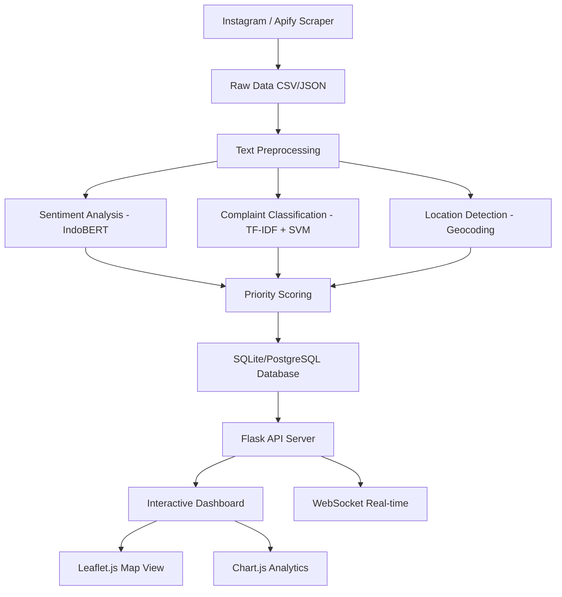

# SurabayaSambat v2 — Audit Mendalam & Implementation Plan

---

## 1. Struktur Folder Saat Ini

```
surabayasambat_demo_monitoring/
├── .env                          # API tokens Apify (AKTIF, ada 2 token)
├── .env.example                  # Template environment variables
├── .gitignore                    # Exclude .env, __pycache__, data/*.csv
├── README.md                     # Panduan menjalankan demo
├── requirements.txt              # Dependencies Python (6 package)
├── config/
│   └── settings.yaml             # Konfigurasi utama (Apify, monitoring, output paths)
├── backend/
│   ├── app.py                    # ⭐ ENTRY POINT — Flask + SocketIO server (537 baris)
│   ├── config.py                 # Loader settings.yaml + .env + path resolver
│   ├── scraper.py                # Apify REST API wrapper (251 baris)
│   ├── monitor.py                # Core logic: state machine monitoring 1-URL (492 baris)
│   ├── discover_posts.py         # Stage 4: multi-account post discovery (450 baris)
│   ├── post_queue.py             # Stage 4: queue management via CSV (139 baris)
│   ├── process_queue.py          # Stage 4: process queue → scrape comments (257 baris)
│   ├── stage4_utils.py           # Shared helpers untuk Stage 4 (88 baris)
│   └── __pycache__/              # Compiled Python cache
├── frontend/
│   ├── index.html                # ⭐ Dashboard utama (419 baris)
│   ├── architecture.html         # Halaman arsitektur visual (666 baris, standalone)
│   ├── css/
│   │   └── style.css             # Stylesheet utama (31KB)
│   └── js/
│       └── app.js                # Frontend logic + SocketIO client (822 baris)
├── data/
│   ├── source_registry.csv       # Daftar akun sumber (4 akun Instagram aktif)
│   ├── raw_instagram_posts.csv   # Output discovery: postingan terdeteksi (~2.5MB)
│   ├── post_queue.csv            # Antrean postingan pending
│   ├── raw_comments.csv          # Komentar dari multi-account (~110KB)
│   └── seen_comments.json        # State persistence untuk dedup
└── tests/
    └── acceptance_stage4.py      # Acceptance tests offline dengan FakeScraper (398 baris)
```

### Fungsi Masing-masing File

| File | Peran |
|------|-------|
| [app.py](file:///c:/Documents/KULIAH/SEMESTER%206/PROJECT/PENELITIANPAKKAMAL/SURABAYASAMBAT/surabayasambat_scraper%20instagram/surabayasambat_demo_monitoring/backend/app.py) | Entry point: Flask server, semua API routes, WebSocket events, background monitoring thread |
| [config.py](file:///c:/Documents/KULIAH/SEMESTER%206/PROJECT/PENELITIANPAKKAMAL/SURABAYASAMBAT/surabayasambat_scraper%20instagram/surabayasambat_demo_monitoring/backend/config.py) | Load YAML config, parse .env tokens, resolve output paths |
| [scraper.py](file:///c:/Documents/KULIAH/SEMESTER%206/PROJECT/PENELITIANPAKKAMAL/SURABAYASAMBAT/surabayasambat_scraper%20instagram/surabayasambat_demo_monitoring/backend/scraper.py) | Apify API wrapper: `scrape_comments()` dan `scrape_profile_posts()`, round-robin token |
| [monitor.py](file:///c:/Documents/KULIAH/SEMESTER%206/PROJECT/PENELITIANPAKKAMAL/SURABAYASAMBAT/surabayasambat_scraper%20instagram/surabayasambat_demo_monitoring/backend/monitor.py) | State machine (idle→collected→monitoring→stopped), dedup via SHA-256 hash, CSV append |
| [discover_posts.py](file:///c:/Documents/KULIAH/SEMESTER%206/PROJECT/PENELITIANPAKKAMAL/SURABAYASAMBAT/surabayasambat_scraper%20instagram/surabayasambat_demo_monitoring/backend/discover_posts.py) | Multi-account discovery: scrape profil → normalisasi → deteksi baru/updated → simpan CSV + queue |
| [post_queue.py](file:///c:/Documents/KULIAH/SEMESTER%206/PROJECT/PENELITIANPAKKAMAL/SURABAYASAMBAT/surabayasambat_scraper%20instagram/surabayasambat_demo_monitoring/backend/post_queue.py) | CRUD queue via pandas DataFrame + CSV persist |
| [process_queue.py](file:///c:/Documents/KULIAH/SEMESTER%206/PROJECT/PENELITIANPAKKAMAL/SURABAYASAMBAT/surabayasambat_scraper%20instagram/surabayasambat_demo_monitoring/backend/process_queue.py) | Ambil komentar per post di queue, dedup, simpan raw_comments.csv |
| [stage4_utils.py](file:///c:/Documents/KULIAH/SEMESTER%206/PROJECT/PENELITIANPAKKAMAL/SURABAYASAMBAT/surabayasambat_scraper%20instagram/surabayasambat_demo_monitoring/backend/stage4_utils.py) | Utilities: SHA-256, timestamp, URL shortcode parser, safe CSV write |
| [index.html](file:///c:/Documents/KULIAH/SEMESTER%206/PROJECT/PENELITIANPAKKAMAL/SURABAYASAMBAT/surabayasambat_scraper%20instagram/surabayasambat_demo_monitoring/frontend/index.html) | Dashboard: metrics cards, stepper UI, log console, chart, data table, Stage 4 panel |
| [app.js](file:///c:/Documents/KULIAH/SEMESTER%206/PROJECT/PENELITIANPAKKAMAL/SURABAYASAMBAT/surabayasambat_scraper%20instagram/surabayasambat_demo_monitoring/frontend/js/app.js) | Dashboard logic: fetch API, SocketIO listeners, Chart.js, toast notifications |
| [style.css](file:///c:/Documents/KULIAH/SEMESTER%206/PROJECT/PENELITIANPAKKAMAL/SURABAYASAMBAT/surabayasambat_scraper%20instagram/surabayasambat_demo_monitoring/frontend/css/style.css) | Full design system: variables, components, animations |
| [acceptance_stage4.py](file:///c:/Documents/KULIAH/SEMESTER%206/PROJECT/PENELITIANPAKKAMAL/SURABAYASAMBAT/surabayasambat_scraper%20instagram/surabayasambat_demo_monitoring/tests/acceptance_stage4.py) | 9 skenario acceptance test dengan FakeScraper (mock) |

---

## 2. Ekstraksi PDF — Source of Truth

### 2.1 Tujuan Sistem SurabayaSambat v2

PDF menjabarkan bahwa v2 adalah **pengembangan lanjutan** dari v1 (scraping), dengan fokus pada:

| # | Tujuan | Status di Codebase |
|---|--------|-------------------|
| a | Pipeline analisis sentimen dan klasifikasi keluhan | ❌ **BELUM ADA** |
| b | Sistem deteksi dan pemetaan lokasi dari teks keluhan | ❌ **BELUM ADA** |
| c | Framework penentuan prioritas penanganan keluhan | ⚠️ **PARSIAL** (hanya keyword-based `post_relevance`) |
| d | Integrasi ke dashboard monitoring interaktif | ✅ **ADA** (tapi belum include fitur b, c) |

### 2.2 Alur Utama Pipeline (dari PDF)



### 2.3 Stack Teknologi Target (dari PDF)

| Komponen | Target PDF | Saat Ini |
|----------|-----------|----------|
| Data Collection | Apify Instagram Scraper | ✅ Ada |
| Backend API | Python + Flask | ✅ Ada |
| NLP/ML | Transformers (IndoBERT), Scikit-learn | ❌ **TIDAK ADA** |
| Geocoding | Nominatim / Google Maps API | ❌ **TIDAK ADA** |
| Database | SQLite (dev) → PostgreSQL (prod) | ❌ **Pakai flat CSV** |
| Frontend | HTML + CSS + JS (Chart.js, **Leaflet.js**) | ⚠️ Chart.js ada, **Leaflet.js TIDAK ADA** |
| Realtime | Flask-SocketIO | ✅ Ada |

### 2.4 Fitur Wajib (dari PDF)

| # | Fitur | Deskripsi Detail PDF | Status |
|---|-------|---------------------|--------|
| 1 | **Text Preprocessing** | Normalisasi slang Surabaya, remove URL/mentions/emoji, Sastrawi stemmer, stopword removal | ❌ |
| 2 | **Sentiment Analysis** | IndoBERT fine-tuned, 3 kelas (negative/neutral/positive), batch prediction | ❌ |
| 3 | **Complaint Classification** | 10 kategori (INFRA, TRANSPORT, LINGKUNGAN, dll.), TF-IDF + SVM, fallback keyword | ❌ |
| 4 | **Location Detection** | Regex + NER lokasi Surabaya (kecamatan, kelurahan, landmark), geocoding Nominatim | ❌ |
| 5 | **Priority Scoring** | Multi-faktor: sentimen × kategori × frekuensi × lokasi → skor 0-100 | ❌ |
| 6 | **Database** | Schema relasional: complaints, locations, categories, priorities | ❌ |
| 7 | **Dashboard Map** | Leaflet.js peta Surabaya, marker keluhan, heatmap hotspot | ❌ |
| 8 | **Dashboard Analytics** | Chart distribusi kategori, tren waktu, top lokasi | ⚠️ Hanya chart siklus |

### 2.5 Entitas Data Utama (dari PDF)

| Entitas | Field Kunci | Status |
|---------|-------------|--------|
| Keluhan/Complaint | id, text, sentiment, category, priority_score, location, timestamp | ❌ Schema belum ada |
| Lokasi | kecamatan, kelurahan, latitude, longitude, keluhan_count | ❌ |
| Kategori | kode (INFRA, TRANSPORT, dll.), deskripsi, keywords | ❌ |
| Prioritas | skor, level (critical/high/medium/low), faktor | ❌ |
| Sumber/Source | akun, platform, status | ✅ source_registry.csv |

### 2.6 Tahapan Penelitian (dari PDF)

1. ✅ Studi awal & evaluasi SurabayaSambat v1
2. ✅ Pengumpulan data keluhan (scraping sudah jalan)
3. ❌ Preprocessing & analisis teks (NLP)
4. ❌ Analisis spasial & prioritas
5. ❌ Model pembelajaran mesin
6. ❌ Implementasi & evaluasi sistem (purwarupa v2)
7. ❌ Diseminasi ilmiah

---

## 3. Gap Analysis — Kondisi Saat Ini vs Target PDF

### 3.1 ✅ Yang Sudah Ada dan Sesuai

| Komponen | Detail |
|----------|--------|
| Scraping Instagram via Apify | Multi-token round-robin, error handling, timeout |
| Monitoring real-time (1-URL) | State machine, dedup SHA-256, CSV storage |
| Multi-account discovery (Stage 4) | Source registry, post discovery, queue management |
| Dashboard web | Flask serving static HTML, WebSocket events |
| Acceptance tests | 9 skenario offline dengan FakeScraper |

### 3.2 ❌ Yang Belum Ada (KRITIS — Core dari PDF)

| # | Komponen Missing | Impact | PDF Reference |
|---|-----------------|--------|---------------|
| 1 | **Text Preprocessing Pipeline** | Teks mentah tidak bisa dianalisis | Section 4.1 |
| 2 | **Sentiment Analysis (IndoBERT)** | Tidak bisa mengetahui sentimen keluhan | Section 4.2 |
| 3 | **Complaint Classification (10 kategori)** | Tidak bisa mengkategorikan jenis keluhan | Section 4.3 |
| 4 | **Location Detection & Geocoding** | Tidak bisa memetakan keluhan ke lokasi Surabaya | Section 4.4 |
| 5 | **Priority Scoring System** | Tidak bisa menentukan urgensi penanganan | Section 4.5 |
| 6 | **Database relasional** | Data tersebar di CSV flat tanpa relasi | Section 2.1 |
| 7 | **Peta interaktif (Leaflet.js)** | Tidak ada visualisasi geospasial | Section 4.7 |
| 8 | **API endpoints analisis** | Backend hanya serve scraping, bukan analisis | Section 3.2 |

### 3.3 ⚠️ Yang Tidak Sesuai Alur

| Issue | Detail | Risiko |
|-------|--------|--------|
| **Arsitektur flat CSV** | PDF menspesifikasikan SQLite→PostgreSQL, tapi sistem pakai CSV + JSON persist | Data integrity rendah, no ACID, race condition |
| **Priority hanya keyword** | `_determine_post_relevance()` di [discover_posts.py](file:///c:/Documents/KULIAH/SEMESTER%206/PROJECT/PENELITIANPAKKAMAL/SURABAYASAMBAT/surabayasambat_scraper%20instagram/surabayasambat_demo_monitoring/backend/discover_posts.py#L227-L241) hanya cek keyword hardcoded → `high/medium/low` | Tidak sesuai multi-faktor scoring di PDF |
| **Monitor hanya 1 URL** | `CommentMonitor` hanya untuk satu `post_url`, Stage 4 terpisah | Alur terputus antara scraping dan analisis |
| **Tidak ada processing layer** | Data langsung dari scraper → CSV, skip NLP/ML | Pipeline tidak ada |

### 3.4 🔄 Yang Duplikatif

| Duplikasi | File A | File B | Masalah |
|-----------|--------|--------|---------|
| Hash function | [monitor.py](file:///c:/Documents/KULIAH/SEMESTER%206/PROJECT/PENELITIANPAKKAMAL/SURABAYASAMBAT/surabayasambat_scraper%20instagram/surabayasambat_demo_monitoring/backend/monitor.py#L60-L70) `_make_hash()` (SHA-256[:16]) | [stage4_utils.py](file:///c:/Documents/KULIAH/SEMESTER%206/PROJECT/PENELITIANPAKKAMAL/SURABAYASAMBAT/surabayasambat_scraper%20instagram/surabayasambat_demo_monitoring/backend/stage4_utils.py#L22-L23) `make_sha256()` (full hash) | Dua fungsi hash berbeda untuk tujuan sama |
| Timestamp | `_now_iso()` di monitor.py (ISO format) | `now_utc()` di stage4_utils.py (strftime format) | Format berbeda untuk field serupa |
| Comment extraction | `_extract_comment_data()` di monitor.py | `_normalize_comment()` di process_queue.py | Dua fungsi normalisasi komentar berbeda |
| CSV writing | `_append_csv()` di monitor.py (manual csv.DictWriter) | `safe_write_csv()` di stage4_utils.py (pandas) | Dua mekanisme tulis CSV berbeda |

### 3.5 ⚡ Yang Rawan Error

| Risk | File | Detail |
|------|------|--------|
| **API token di .env tersimpan** | [.env](file:///c:/Documents/KULIAH/SEMESTER%206/PROJECT/PENELITIANPAKKAMAL/SURABAYASAMBAT/surabayasambat_scraper%20instagram/surabayasambat_demo_monitoring/.env) | Token Apify real terekspos di file — walaupun `.gitignore` ada |
| **Secret key hardcoded** | [app.py:37](file:///c:/Documents/KULIAH/SEMESTER%206/PROJECT/PENELITIANPAKKAMAL/SURABAYASAMBAT/surabayasambat_scraper%20instagram/surabayasambat_demo_monitoring/backend/app.py#L37) | `app.config["SECRET_KEY"] = "surabayasambat-demo-2026"` |
| **Race condition CSV** | [monitor.py:450-461](file:///c:/Documents/KULIAH/SEMESTER%206/PROJECT/PENELITIANPAKKAMAL/SURABAYASAMBAT/surabayasambat_scraper%20instagram/surabayasambat_demo_monitoring/backend/monitor.py#L450-L461) | `_append_csv()` tidak thread-safe, bisa corrupt saat concurrent write |
| **Global mutable state** | [app.py:55-69](file:///c:/Documents/KULIAH/SEMESTER%206/PROJECT/PENELITIANPAKKAMAL/SURABAYASAMBAT/surabayasambat_scraper%20instagram/surabayasambat_demo_monitoring/backend/app.py#L55-L69) | `scraper`, `monitor`, `_monitoring_thread` sebagai global — tidak testable |
| **No input validation** | Semua API routes | POST routes tidak validate request body, bisa crash |
| **Unsafe werkzeug** | [app.py:536](file:///c:/Documents/KULIAH/SEMESTER%206/PROJECT/PENELITIANPAKKAMAL/SURABAYASAMBAT/surabayasambat_scraper%20instagram/surabayasambat_demo_monitoring/backend/app.py#L536) | `allow_unsafe_werkzeug=True` — dev only |
| **CORS wildcard** | [app.py:39](file:///c:/Documents/KULIAH/SEMESTER%206/PROJECT/PENELITIANPAKKAMAL/SURABAYASAMBAT/surabayasambat_scraper%20instagram/surabayasambat_demo_monitoring/backend/app.py#L39) | `cors_allowed_origins="*"` — insecure |
| **CSV as database** | Semua data modules | Full rewrite on every update (pandas concat → to_csv), no locking |
| **No error recovery** | monitor.py state | Jika crash saat write, state bisa inconsistent |

---

## 4. Audit Teknis Mendalam

### 4.1 Arsitektur

| Aspek | Penilaian | Catatan |
|-------|-----------|---------|
| **Separation of Concerns** | ⚠️ Parsial | Scraping terpisah dari monitoring, tapi app.py melakukan routing + business logic + emit events sekaligus |
| **Modularitas** | ⚠️ Parsial | Stage 4 modules cukup modular, tapi monitor.py monolitik (state + persistence + CSV + dedup dalam 1 class) |
| **Testability** | ⚠️ Parsial | acceptance_stage4.py bagus (FakeScraper), tapi monitor.py + app.py tidak ada unit test |
| **Scalability** | ❌ Rendah | CSV-based storage tidak scale, pandas rewrite seluruh file per update |
| **Configuration** | ✅ Baik | settings.yaml + .env terpisah, path resolution via config.py |

### 4.2 Backend Code Quality

| Metrik | Detail |
|--------|--------|
| **Total baris backend** | ~2,080 baris Python |
| **Docstrings** | ✅ Cukup baik — semua class dan fungsi utama punya docstring |
| **Type hints** | ⚠️ Parsial — return types ada, parameter types jarang |
| **Error handling** | ✅ Apify errors ditangani dengan baik (timeout, quota, connection) |
| **Logging** | ✅ Konsisten — semua module pakai `logger = logging.getLogger("demo_monitor")` |
| **Magic numbers** | ⚠️ Ada — limit 1000, 50, 100, dll. tapi sudah di settings.yaml |

### 4.3 Frontend Code Quality

| Metrik | Detail |
|--------|--------|
| **Total baris frontend** | ~1,900 baris (HTML + CSS + JS) |
| **Design system** | ✅ Baik — CSS variables, consistent spacing, glassmorphism |
| **Accessibility** | ⚠️ Parsial — ada `role`, `aria-label`, tapi tabel tanpa proper `scope` di semua tempat |
| **XSS protection** | ✅ Ada `escapeHtml()` untuk semua output |
| **Responsive** | ⚠️ Tidak terlihat media queries yang komprehensif di HTML |
| **Performance** | ⚠️ CDN dependencies (Chart.js, Socket.IO, Lucide) — no fallback |

### 4.4 Data Flow

```
CURRENT FLOW (yang ada):
Instagram → Apify API → scraper.py → monitor.py/discover_posts.py → CSV files → Dashboard (table)

TARGET FLOW (dari PDF):
Instagram → Apify API → Raw Data → Preprocessing → Sentiment → Classification → Location → Priority → Database → API → Dashboard (Map + Charts + Tables)
                                     ↑ MISSING PIPELINE ↑
```

### 4.5 Security Audit

| Finding | Severity | Location |
|---------|----------|----------|
| API tokens in plaintext .env | 🟡 Medium | `.env` (gitignored tapi ada di workspace) |
| Hardcoded SECRET_KEY | 🔴 High | `app.py:37` |
| CORS wildcard `*` | 🟡 Medium | `app.py:39` |
| No authentication | 🔴 High | Semua API endpoint publik |
| No rate limiting | 🟡 Medium | API routes tanpa throttle |
| Unsafe werkzeug | 🟡 Medium | `app.py:536` |
| No CSRF protection | 🟡 Medium | POST routes tanpa CSRF token |

---

## 5. Hal yang Perlu Dirapikan Sebelum Menambah Fitur

> [!IMPORTANT]
> Sebelum menambah fitur NLP/ML/Geocoding, codebase perlu dirapikan dulu agar fondasi kuat.

### 5.1 Fase 0 — Foundation Cleanup (PRIORITAS)

1. **Unifikasi hash & timestamp functions** — Satu module `utils.py` yang dipakai semua
2. **Migrasi CSV → SQLite** — Sebagai langkah pertama menuju database relasional
3. **Thread-safe data access** — Lock mechanism untuk concurrent read/write
4. **Extract business logic dari app.py** — app.py hanya routing, logic di service layer
5. **Secret key dari env** — `SECRET_KEY` pindah ke `.env`
6. **CORS restrict** — Ganti `*` dengan origin spesifik
7. **Add `__init__.py`** — Jadikan `backend/` proper Python package

### 5.2 Fase 1 — NLP Processing Layer

1. **Text Preprocessing** — Module `preprocessing.py` (clean, normalize slang, stem)
2. **Sentiment Analysis** — Module `sentiment.py` (IndoBERT wrapper)
3. **Complaint Classification** — Module `classifier.py` (TF-IDF + SVM, fallback keyword)
4. **Pipeline orchestrator** — Module `pipeline.py` yang chain semua steps

### 5.3 Fase 2 — Location & Priority

1. **Location Detection** — Module `location.py` (regex kecamatan/kelurahan + geocoding)
2. **Priority Scoring** — Module `priority.py` (multi-factor scoring 0-100)
3. **Database schema** — SQLite tables: complaints, locations, categories, priorities

### 5.4 Fase 3 — Dashboard Enhancement

1. **Peta Leaflet.js** — Panel map dengan marker keluhan per lokasi
2. **Chart analytics** — Distribusi kategori, tren waktu, heatmap
3. **Filter & search** — UI untuk filter berdasarkan kategori, lokasi, prioritas
4. **Export report** — Generate PDF/CSV laporan analisis

---

## Open Questions

> [!IMPORTANT]
> Pertanyaan-pertanyaan berikut perlu dijawab sebelum memulai implementasi.

1. **Urutan implementasi**: Apakah kita mulai dari Fase 0 (cleanup) terlebih dahulu, atau langsung Fase 1 (NLP)? Rekomendasi saya: **Fase 0 dulu** agar fondasi tidak fragile.

2. **IndoBERT model**: Apakah model IndoBERT sudah di-fine-tune dan tersedia, atau perlu training dari awal? Ini menentukan apakah kita perlu pipeline training atau hanya inference.

3. **Database**: Apakah kita langsung pakai SQLite di development (sesuai PDF), atau ada preferensi lain?

4. **Leaflet.js vs alternatif**: Apakah peta menggunakan Leaflet.js sesuai PDF, atau ada alternatif yang lebih disukai?

5. **Scope iterasi pertama**: Mengingat besarnya gap, apakah kita fokus pada satu fase per iterasi, atau ada komponen tertentu yang paling urgent?

6. **Data existing**: Apakah data di `raw_instagram_posts.csv` (2.5MB) dan `raw_comments.csv` (110KB) yang sudah terkumpul akan dipakai sebagai dataset awal untuk processing pipeline?

---

## Verification Plan

### Automated Tests
- Run `python tests/acceptance_stage4.py` — pastikan 9 skenario tetap PASS setelah refactor
- Tambah unit tests untuk setiap module baru (preprocessing, sentiment, classifier, location, priority)
- Integration test: end-to-end dari raw comment → processed complaint dengan scored priority

### Manual Verification
- Dashboard harus tetap berjalan di `localhost:5000` setelah setiap fase
- Peta Leaflet.js menampilkan marker di lokasi Surabaya yang benar
- Priority scoring menghasilkan distribusi yang masuk akal (bukan semua high/low)
